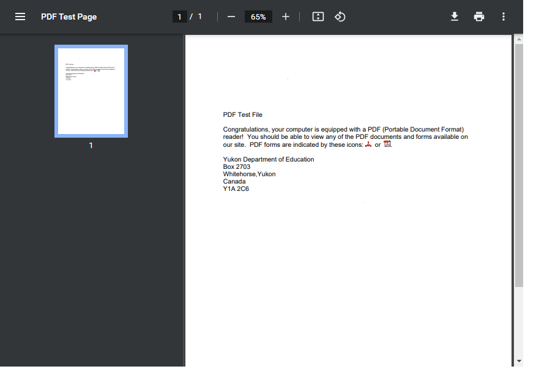

📢 Use this project, [contribute](https://github.com/{OrganizationName}/{AppName}) to it or open issues to help evolve it using [Store Discussion](https://github.com/vtex-apps/store-discussion).

# Read-PDF

Componente que permite leer un pdf 

## Configuration 

1. Añade a tu manifest.json la dependencia `itgloberspartnercl.bullets-diagramations`;
2. Para declarar este componente debes configurar las siguientes propiedades.

### `read-pdf` props
| Prop name | Type | Description | `required` |
| --------- | ---- | ----------- | ---------- |
 | `url`      | `string`       | url del pdf que se desea width         | `true`|
| `width`      | `number`       | Ancho en pixeles del pdf        |    `true`     |
| `hight`      | `number`       | Alto en pixeles del pdf         |      `true`   |

